# 🤖 AI-Powered Math Learning & Quiz Web App (with GROQ API)

An intelligent and interactive **Math Learning Platform** powered by **GROQ AI**, designed to help users explore math concepts, solve problems step-by-step, generate quizzes, and learn visually and vocally — all in one place.

---

## 🚀 Features

### 📘 1. Topic-Wise Explanation (Chapter-Wise)
- Separate sections for Algebra, Geometry, Trigonometry, Calculus, etc.
- GROQ-generated topic breakdowns with real-world examples.

> 🧠 Prompt: `Explain the concept of integration with a real-life example.`

---

### 🧮 2. Step-by-Step Problem Solver
- Type an equation like: `2x + 3 = 9`
- Get a full solution with steps via GROQ.

> 🧠 Prompt: `Solve this equation step by step: 2x + 3 = 9`

---

### 🎙️ 3. Voice Input & Output
- Speak your math problem and hear the answer back.
- Converts voice to text → Sends to GROQ → Speaks the result using TTS.

---

### ✍️ 4. LaTeX Math Renderer
- All results are rendered beautifully using LaTeX.
- Supports equations, fractions, square roots, integrals, etc.

---

### 📚 5. Practice Questions Generator
- Ask: `Give me 5 questions on trigonometry`
- Instantly get random questions with/without answers or hints.

---

### 🖼️ 6. Doubt Solver with Image Upload
- Upload your handwritten question.
- OCR extracts text and sends it to GROQ for answers.

---

### 🧪 7. Quiz Mode with Timer
- Choose topic, difficulty, number of questions.
- GROQ generates quiz with a timer.
- Shows score, correct answers, and explanations.

---

### 📆 8. Daily Math Challenge
- New math puzzle or riddle every day.
- Perfect for quick brain workouts.

---

### 🗣️ 9. Natural Language to Formula
- Speak/type: `What is the area of a circle with radius 7?`
- Auto-formulated, solved, and explained.

---

### 📌 10. Chat History & Bookmarking
- Auto-save asked questions and solutions.
- Bookmark key explanations for later.

---

## 🧠 Powered by GROQ

API Key (example):  

An intelligent and interactive **Math Learning Platform** powered by **GROQ AI**, designed to help users explore math concepts, solve problems step-by-step, generate quizzes, and learn visually and vocally — all in one place.

--

# Authentication Flow

# System Working Flow 

```mermaid
flowchart TD
    A["Frontend"] --> B["API Routes"]
    B --> B1["/"]
    B --> B2["/api/solve"]
    B --> B3["/api/explain"]
    B --> C["GROQ API (AI)\n🧠 gsk_... token"]
    D["OCR / Voice / UI\nImage → Text\nSpeech ↔ Text"] --> C
    
    style A fill:#4CAF50,stroke:#2E7D32,stroke-width:2px
    style B fill:#2196F3,stroke:#1565C0,stroke-width:2px
    style C fill:#FF9800,stroke:#F57C00,stroke-width:2px
    style D fill:#9C27B0,stroke:#7B1FA2,stroke-width:2px
```

